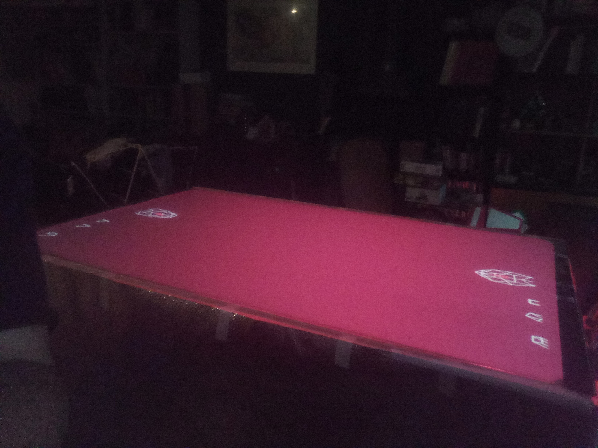

# Cheapest simplest touchscreen technology

## Principle

A videoprojector is used to display the image from below onto a diffusive filter.
An InfraRed camera points at the screen and detects the fingers.

## Bill of Materials

The most expensive components is the video projector. You can get the whole rest for a few hundred bucks.

- A frame. I used aluminium beams because they are relatively cheap and easy to assemble
- Opaque fabric or whatever to cover the sides of the frame
- A plexiglas transparent surface
- A diffusive filter, same size as plexi: I use a lee filter sheet.
- A videoprojector. You need a "short throw" (short focus) one.
- An IR webcam: you can remove the IR band-supress filter on a regular camera, or use a "security night camera" that usually doesn't have one
- An IR bandpass filter for the camera
- A powerful IR light source: I tried IR leds without success, so I settled for an aquarium IR lamps that also emits in the visible. Gives a nice red glow to the thing :)

## Finger detection software

After many attempts at a robust algorithm I settled for a neural network solution
that works like a charm after training.

### Algorithm

- Grabs a grayscale image
- Substract the background (just an image you grabbed at initialization)
- Subsample by 4x4 using a "minimum value" aggregate
- Locate the point with highest intensity
- Compute the center of mass of a small region centered on that point to get a candidate finger center point
- Extract a window (on the full res image) around that point. I use a size of four times the width of a finger.
- Keep this as a candidate sample. Blank out the zone on the subsample image, and try again.
- Do this until you get 10 candidate samples (or you reached a fixed intensity threshold)
- Feed the samples to the trained neural network (on my computer it anwsers in 10ms)

### Neural network

I used the "LeNet" from pytorch basic tutorial.
I trained it using 10000 80x80 images acquired by the process above, augmented by rotating them 90, 180 and 270 degres.
You need roughly half "fingertip" images and half "not fingertip" images (other part of the finger, palm, ...).
Be very strict when labeling the images: If the tip is not centered label the image as a "no".
The network reached 98% accuracy on the test subset in a few iterations.

## Camera to screen coordinate transformation

I'm using a grid of known points entered by the user by clicking on coordinates on a grid,
then linear interpolation.
For better results consider correcting the lens distortion before feeding the image to the algorithm.
